# Forma — Implementation Roadmap

**Tanggal:** 9 Oktober 2026
**Status:** Usulan; menunggu persetujuan D-01 (lihat [TECHNICAL_DECISIONS](TECHNICAL_DECISIONS.md)).
**Dasar:** [INITIAL_AUDIT](../audits/INITIAL_AUDIT.md). Repository masih greenfield: semua fase di bawah bersifat *rencana*, nama file bersifat *perkiraan* (blueprint §7 tahap 8: "rencana, bukan klaim pasti"), dan semua perintah verifikasi harus **benar-benar dijalankan** sebelum diklaim lulus.

---

## 1. Ringkasan urutan

Menyimpang dari urutan blueprint §18 pada satu hal: **compiler didahulukan sebelum UI shell dan persistence server** (konflik C-01).

```mermaid
flowchart LR
  R0["R0 Fondasi repo (Done)"] --> R1["R1 Compiler murni (Done)"]
  R1 --> R2["R2 Vertical slice MVP-Core (Done)"]
  R2 --> R3["R3 Prompt Chain Foundation (Done)"]
  R3 --> R4["R4 Export pack .zip & template lanjutan"]
  R4 --> R5["R5 Server persistence & multi-device auth"]
  R5 --> R6["R6 Artefak & traceability"]
  R6 --> R7["R7 AI assistance (opsional)"]
  R7 --> R8["R8 Hardening & rilis"]
```

| Fase | Nama | Status | Menghasilkan nilai bagi pengguna? | Kriteria MVP blueprint yang terpenuhi |
|---|---|---|---|---|
| R0 | Fondasi repo | Selesai (Verified) | Tidak (infrastruktur) | #19 (sebagian) |
| R1 | Compiler murni + fixture | Selesai (Verified) | Tidak langsung (diuji lewat test) | #7 (inti), #10 (sebagian), #16 (sebagian) |
| R2 | Vertical slice MVP-Core | Selesai (Verified) | Ya | #1, #2, #7, #8, #17, #18 |
| **R3** | **Prompt Chain Foundation (P-00 → P-01 → P-02)** | **Selesai (Verified)** | **Ya** | #8, #9, #10, #11, #13, #15, #16 |
| R4 | Export pack `.zip` + template P-03…P-12 | Rencana | Ya | #12 |
| R5 | Server persistence & multi-device auth | Rencana | Ya | #20 |
| R6 | Artefak, requirement, asumsi/open question | Ditunda | Sedang | #4, #5, #6, #14 |
| R7 | AI assistance | Opsional | Sedang | — |
| R8 | Hardening & rilis | Wajib sebelum publik | — | #16, #17, #19, #20 |

**MVP-Core** = R0 + R1 + R2. **MVP-Chain** = R0–R3. **MVP-Full** = R0–R6 + R8.

---

## 2. Definisi bersama

### Definition of Ready (per slice)
- Acceptance criteria tertulis dan dapat diuji.
- Keputusan yang memblokir sudah disetujui atau diganti asumsi bertanda.
- Fixture/data uji yang dibutuhkan sudah dipilih.

### Definition of Done (per slice; selaras master prompt §I)
1. Acceptance criteria diverifikasi (bukan hanya "halaman tampil").
2. `lint`, `typecheck`, `test`, dan `build` dijalankan; hasil aktual dicatat. Tidak ada tes dinonaktifkan agar hijau.
3. Jalur error/empty/loading yang relevan diuji.
4. Dampak keamanan diperiksa (secret, XSS, injeksi template, otorisasi bila ada server).
5. Dokumentasi/`.env.example`/ADR diperbarui; tidak ada secret di diff.
6. Keterbatasan dilaporkan jujur, dengan format laporan master prompt (scope, behavior, keputusan, verifikasi, risiko, slice berikutnya).

> **Perintah verifikasi** akan didefinisikan sebagai npm scripts di R0 (`lint`, `typecheck`, `test`, `build`, `test:e2e`). Sampai R0 selesai, perintah-perintah itu *belum ada*.

---

## 3. Fase

### R0 — Fondasi repository (housekeeping teknis)

**Scope:** `git init`, `.gitignore`, scaffold Next.js via `npx -y create-next-app@latest ./ --yes` (jalankan `--help` terlebih dulu; scaffold menyertakan `AGENTS.md`), tambah Vitest, Zod, scripts, ESLint rule batas modul, `README` setup. Tidak ada fitur.
**Out of scope:** UI, template, storage, Playwright.
**Perkiraan file:** `package.json`, `package-lock.json`, `tsconfig.json`, `eslint.config.*`, `vitest.config.ts`, `.gitignore`, `.env.example`, `AGENTS.md`, `src/app/layout.tsx` + `page.tsx` (placeholder scaffold), `docs/decisions/ADR-0001…`, `README.md` (bagian setup).
**Acceptance criteria:**
- `npm run lint`, `typecheck`, `test` (satu tes sampel), `build` berhasil — hasil aktual dicatat di PR/laporan.
- Aturan ESLint menolak `modules/prompt-compiler` mengimpor `react`/`next` (dibuktikan dengan satu tes/negatif).
- Versi Next.js, TypeScript, Tailwind terpasang dicatat; kompatibilitas TS ↔ Next terbukti oleh build (menutup temuan "belum terverifikasi").
- Dokumen sumber tidak dipindah kecuali D-07 disetujui; bila dipindah, grep menunjukkan nol tautan rusak.
**Test plan:** tes sampel Vitest; verifikasi manual `npm run dev` membuka halaman scaffold.
**Risiko:** TS 7 / Next 16 tidak cocok → pakai versi yang dipilih scaffold; Cache Components memengaruhi perilaku → matikan jika menyulitkan (AS-07).
**Dependency:** persetujuan D-08, D-15, D-01.
**DoD:** DoD bersama + semua ADR yang disetujui sudah ditulis.

---

### R1 — Compiler murni + fixture (tanpa UI, tanpa storage)

**Scope:** `modules/prompt-compiler`, `modules/templates` (P-00 seed + metadata), `modules/projects` (tipe & schema jawaban saja), `modules/runs` (tipe + hashing). Spike engine (D-04).
- Tipe & schema Zod: `ProjectAnswer` (key, value, valueType, certainty incl. `preference`, source), `PromptTemplate(+Version)`, `ProjectContextSnapshot`, `PromptGenerationRun`.
- `resolveContext`: answers → `ProjectContext` dengan namespace `answers` & `derived` (confirmed/assumption/unknown/open questions).
- Lapisan prompt: global contract inline + envelope + stage template + adapter (web, mobile, backend minimal) + output contract.
- Filter allowlist: `or_unknown`, `format_list_or_unknown`, `format_list_or_none`, `or_default`.
- Validasi: required kosong, unresolved token, secret terdeteksi, konflik jawaban key sama, template tidak valid (variable asing, tanpa output contract).
- Teks pertanyaan per field P-00 (G-07) sebagai data: label, alasan, contoh, tipe, wajib/opsional.
**Out of scope:** UI, persistence, chain, agent result, AI, export zip, template selain P-00 (dan fixture P-04W/P-04M sebagai uji adapter bila sempat).
**Perkiraan file:** `src/modules/prompt-compiler/{compile,resolve-context,validate}.ts`, `…/engine/*`, `…/filters/*`, `…/layers/*`; `src/modules/templates/seeds/P-00-IDEA/v1.*`; `src/modules/projects/schema.ts`; `src/modules/runs/{types,hash}.ts`; `tests/fixtures/*`.
**Acceptance criteria (semua otomatis):**
1. Mengubah satu jawaban mengubah hanya bagian prompt yang relevan (diff test).
2. `platforms=[web]` vs `[android]` menghasilkan section adapter berbeda; section yang tidak relevan **tidak** muncul dan tidak ada heading kosong.
3. Field wajib kosong tanpa representasi unknown → status `blocked` + pesan menunjuk key-nya.
4. `unknown` dirender sebagai instruksi eksplisit "belum diketahui, jangan mengarang"; `preference` dirender "preferensi awal, bukan keputusan final".
5. Output final tidak mengandung `{{`, `{%`.
6. Konten jawaban yang menyerupai instruksi (fixture #8) muncul sebagai data ter-fence, tidak mengubah global contract.
7. Secret-like string (fixture #9) → `blocked`, tidak pernah muncul di output tanpa tindakan eksplisit.
8. Template dengan variable asing/tanpa output contract (fixture #10) ditolak saat validasi.
9. Output deterministik: input sama → byte-identik; run mencatat `templateVersion` + `contextHash`.
10. Tidak ada import `react`/`next`/DOM/`fs` di modul compiler (lint).
11. Keputusan D-04 dicatat di ADR-0003 dengan hasil spike aktual.
**Test plan:** Vitest unit + golden file. Fixture dari katalog §11: #1 landing, #3 offline-first mobile, #5 unknown-heavy, #8, #9, #10 wajib di R1; #2, #4 (platform/backend) minimal untuk adapter; #6, #7 menunggu R4.
**Risiko:** allowlist tag LiquidJS gagal → renderer sendiri (+1–2 hari); golden output belum disepakati (C-04) → blokir sampai pemilik produk menyetujui satu render P-00; false positive/negative detektor secret.
**Dependency:** R0; D-04 (spike), D-05, D-06, D-13, D-14.
**DoD:** DoD bersama + semua AC di atas hijau, tanpa test dinonaktifkan.

---

### R2 — ★ Vertical slice pertama: buat proyek → jawab → konteks → compile → preview/edit → copy/download

Ini MVP utama dari brief. **Detail lengkap di §4.**

---

### R3 — Riwayat run, versi template, persistence server, otorisasi

**Scope:** daftar run per proyek + lihat snapshot; template versioning bukti (v1 vs v2 tidak mengubah run lama); keputusan D-03 → implementasi `storage-server` di balik port yang sama; migrasi bila memakai DB; auth + otorisasi server **sebelum** deployment publik; test lintas-user/IDOR; migrasi data browser → server via Import JSON.
**Out of scope:** chain, agent result.
**Perkiraan file:** `src/infrastructure/storage-server/*`, `src/modules/runs/*`, `src/app/projects/[id]/runs/*`, folder migrasi sesuai tool, `docs/security/SECURITY_AND_PRIVACY.md`, `docs/architecture/SYSTEM_ARCHITECTURE.md`.
**Acceptance criteria:** (1) run lama tidak berubah setelah jawaban/template diubah (integration test). (2) Snapshot dapat dilihat dan cocok dengan prompt. (3) Pengguna A tidak bisa membaca/mengubah proyek/run pengguna B dengan mengganti ID (API + UI test). (4) Migrasi dapat dijalankan dari nol dan diulang aman; rollback terdokumentasi. (5) Tidak ada secret di log.
**Test plan:** integration test repository dengan DB uji; test otorisasi negatif; migrasi up pada DB kosong.
**Risiko:** salah memilih DB/hosting (D-03); Prisma 8 RC / Drizzle 0.x belum stabil; kebocoran lintas-user.
**Dependency:** R2 + keputusan D-03/auth. **DoD:** bersama + review keamanan jalur data.

---

### R4 — Prompt chain, hasil agent eksternal, stale

**Scope:** `prompt-chain`, `agent-results`; P-01 dan P-02; capture hasil (paste/upload `.md`) → edit → approve/reject (D-12) → upstream pack; prerequisite checks; stale **dihitung** (D-09); deteksi siklus dependency.
**Perkiraan file:** `src/modules/prompt-chain/*`, `src/modules/agent-results/*`, `src/modules/templates/seeds/P-01-*`, `P-02-*`, UI di `src/app/studio/*`.
**Acceptance criteria:** (1) hasil `captured/in_review/rejected` **tidak pernah** muncul di prompt downstream (fixture #7). (2) Setelah approve, P-02 memuat isi approved + ID/versi. (3) Mengubah hasil approved/ jawaban upstream menandai run downstream `stale` dengan alasan dan sumbernya; run lama tidak dimutasi (fixture #6). (4) Prerequisite belum approved → `blocked`, atau override dengan alasan tercatat. (5) Template dengan siklus ditolak. (6) Teks hasil agent diperlakukan sebagai data tidak tepercaya (fixture #8).
**Test plan:** unit test graph & stale; integration: alur penuh P-00→P-01→P-02 dengan KostCerdas; E2E Playwright satu jalur.
**Risiko:** konteks upstream terlalu besar (G-04); kompleksitas UI review.
**Dependency:** R3 (persistence yang tahan), D-09, D-12. **DoD:** bersama + E2E hijau.

---

### R5 — Export pack + template lanjutan

**Scope:** `.md` tunggal (sudah di R2) → Prompt Pack `.zip` dengan `README.md`, `PROJECT_CONTEXT.md`, `PROMPT_CHAIN_INDEX.md`, manifest versi; pilih library zip (bandingkan `fflate`/`jszip`); template P-03, P-04W/M, P-05…P-12 satu per satu dengan fixture; template custom/clone (hanya bila risiko R-01 tertangani).
**Acceptance criteria:** zip dapat dibuka; semua tautan relatif valid (tes pembuka zip + checker link); tidak ada secret di export (test); index menyebut urutan, prerequisite, status; setiap template baru lulus kontrak katalog §10.
**Risiko:** dependency baru; kualitas template (butuh uji dengan agent nyata — tidak diklaim di sini).
**Dependency:** R4. **DoD:** bersama + export integrity test.

---

### R6 — Artefak, requirement, asumsi/open question (dipangkas)

**Scope minimum:** editor Markdown + preview, versi artefak & restore (butir #14), daftar asumsi/open question bersertifikasi (#5), tampilan blocker (#6). **Bukan** backlog planner / risk register / traceability graph penuh kecuali terbukti dibutuhkan pengguna.
**Acceptance criteria:** autosave dengan state saved/unsaved/error; restore versi lama menghasilkan versi baru (tidak menimpa); tidak ada kehilangan perubahan diam-diam.
**Risiko:** scope creep ke klon Jira/Linear — setiap penambahan harus menjawab "membantu compile prompt?". **Dependency:** R4.

---

### R7 — AI assistance (opsional)

**Scope:** `AiProvider` port + satu adapter; interviewer satu-pertanyaan; ekstraksi terstruktur dari hasil agent dengan validasi Zod + review; BYOK terenkripsi atau server key; ringkasan data yang dikirim ke provider; fallback manual tetap utuh.
**Acceptance criteria:** semua fitur compile/copy/export tetap lulus **dengan provider mati**; data yang dikirim ditampilkan dan diminimalkan; key tidak pernah di log/DB teks biasa.
**Dependency:** keputusan provider/BYOK (D-11, blueprint §21 #2–3), docs resmi provider diperiksa saat itu.

---

### R8 — Hardening & rilis

**Scope:** E2E regresi, review keamanan (ASVS-lite sesuai risiko), aksesibilitas (keyboard, focus, kontras), pengukuran performa (angka target ditetapkan **setelah** deployment diketahui), observability seperlunya, CI (GitHub Actions: lint, typecheck, test, build), `README` setup lengkap, release checklist.
**Acceptance criteria:** semua 20 butir blueprint §16 berstatus lulus/ditunda-dengan-alasan; `npm audit` tanpa high/critical yang belum dibahas; checklist rilis terisi dengan bukti.

---

## 4. Slice pertama yang diusulkan: **R2 — "Prompt P-00 untuk satu proyek, sampai file `.md`"**

### Tujuan pengguna
Pengguna yang membuka Forma dapat, dalam satu sesi tanpa API key: membuat proyek, menjawab pertanyaan P-00, melihat prompt lengkap yang berubah mengikuti jawaban, mengeditnya untuk satu run, lalu menyalin atau mengunduh sebagai `.md`.

### In scope
1. Daftar proyek sederhana + empty state + tombol "Proyek baru" (bukan dashboard).
2. Form proyek: nama, deskripsi ide, platform (checkbox: web, android, ios, cross-platform mobile, backend/API), track (quick/standard/advanced) — tiap field boleh "belum tahu" (certainty `unknown`).
3. Halaman Prompt Studio P-00: pertanyaan dengan alasan, wajib/opsional, status certainty per jawaban (confirmed/assumption/unknown/preference).
4. Penyimpanan jawaban terstruktur di browser (D-02), di balik port.
5. Compile → preview (read-only) + panel **Completeness** (field wajib kosong, konflik, secret).
6. Edit prompt untuk satu run (area terpisah; `compiledPrompt` tidak ditimpa).
7. Copy ke clipboard + download `<project>-P-00-v1.md` (dengan header: template id/versi, hash konteks, tanggal).
8. Lihat context snapshot untuk run saat ini (ringkas).
9. Export/Import JSON proyek (mitigasi kehilangan data di browser).
10. Layout responsif 360 px & 1280 px, keyboard + focus + label form.

### Out of scope (eksplisit)
Dashboard/skor, gate/workflow, auth, database server, chain/agent result, P-01+ , zip, template custom, AI, artifact editor, riwayat run lengkap (hanya run terakhir di R2; riwayat di R3), tema/gradient dekoratif.

### Perkiraan file/modul
`src/app/projects/{page,new/page,[id]/page}.tsx`, `src/app/studio/[projectId]/p-00/page.tsx`, `src/components/ui/*` (Button, Input, Textarea, Checkbox, Tabs), `src/components/shared/{CopyButton,EmptyState,CertaintyBadge}.tsx`, `src/infrastructure/storage-browser/*`, `src/modules/projects/{repository,service}.ts`, `src/modules/runs/service.ts`, `tests/e2e/first-slice.spec.ts`. Compiler dan template dari R1 **tidak diubah** kecuali bug ditemukan.

### Acceptance criteria (R2)
| # | Kriteria | Cara verifikasi |
|---|---|---|
| 1 | Tanpa konfigurasi apa pun (tanpa `.env`, tanpa jaringan eksternal) alur berjalan penuh | E2E dengan jaringan eksternal diblok |
| 2 | Membuat proyek dengan platform `web` vs `android` menghasilkan prompt berbeda pada section platform | E2E + snapshot |
| 3 | Mengubah satu jawaban lalu compile ulang mengubah bagian terkait; run sebelumnya tidak terubah | E2E + unit |
| 4 | Jawaban "belum tahu" tampil sebagai ketidakpastian eksplisit di prompt | E2E assert teks |
| 5 | Field wajib kosong menampilkan blocker yang menyebut field-nya; tombol copy/download dinonaktifkan atau meminta override tercatat | E2E |
| 6 | Secret-like string pada jawaban → `blocked`, tidak keluar via copy/download | E2E + unit |
| 7 | Copy menghasilkan teks identik dengan preview; file `.md` terunduh berisi header + prompt tanpa `{{`/`{%` | E2E baca file |
| 8 | Reload halaman: proyek, jawaban, dan edit run terakhir tetap ada; ada indikator saved/unsaved/error; penyimpanan gagal ditampilkan, bukan diam-diam | E2E + simulasi quota error |
| 9 | Export lalu Import JSON memulihkan proyek ke keadaan yang sama | integration |
| 10 | Layout tidak patah pada 360 px dan 1280 px; semua kontrol terjangkau keyboard dengan fokus terlihat; semua input berlabel | Playwright + pemeriksaan manual aksesibilitas dasar |
| 11 | Preview dirender sebagai teks (bukan HTML); input berisi `<script>` tidak dieksekusi | E2E |
| 12 | `lint`, `typecheck`, `test`, `build`, `test:e2e` dijalankan dengan hasil aktual dilaporkan | log perintah |

### Test plan R2
- **Unit (R1, tetap):** compiler/validasi.
- **Integration:** repository browser (jsdom atau stub storage), serialisasi/impor JSON.
- **E2E (Playwright):** satu spesifikasi `first-slice` dengan kasus: web-only, android, unknown-heavy, secret, field wajib kosong, reload, import/export; viewport 360 & 1280.
- **Manual:** keyboard-only walkthrough; satu kali pembacaan hasil prompt oleh pemilik produk untuk menyetujui golden output.

### Risiko R2
- Kehilangan data di localStorage (kuota, clear data) → export/import + peringatan jelas.
- Pemilik produk belum menyetujui kualitas teks P-00 → timebox review 1 putaran.
- UI membesar menjadi "dashboard" → batasi ke 3 halaman.

### Dependency R2
R0, R1 selesai; D-01, D-02, D-10 disetujui.

### DoD R2
DoD bersama + 12 acceptance criteria di atas terverifikasi dengan bukti perintah aktual + laporan jujur tentang yang belum (riwayat run, server, auth).

---

## 5. Pemetaan 20 kriteria MVP blueprint §16

| # | Kriteria | Fase | Catatan |
|---|---|---|---|
| 1 | Buat proyek dari ide singkat | R2 | |
| 2 | Platform & kedalaman | R2 | |
| 3 | Tahapan relevan & next action | R4/R6 | Di R2 hanya P-00; "next" = rekomendasi template berikutnya sebagai teks |
| 4 | Buat/edit/simpan artefak Markdown | R6 | ditunda |
| 5 | Fakta/asumsi/open question terbedakan | R2 (di jawaban), R6 (daftar) | |
| 6 | Gate & blocker | R6 | Hanya blocker compile di R2 |
| 7 | Prompt berbeda per platform/jawaban | R1–R2 | |
| 8 | Preview, copy, download, versi template, snapshot | R2, R3 | |
| 9 | Chain memakai upstream approved | R4 | |
| 10 | Warning/blocker jelas | R1–R2, R4 | |
| 11 | Hasil agent masuk, direview, approve | R4 | |
| 12 | Prompt pack `.zip` | R5 | |
| 13 | Riwayat run & versi template | R3 | |
| 14 | Versi artefak dapat dipulihkan | R6 | |
| 15 | Anti-IDOR | R3 | N/A sebelum server |
| 16 | Test otomatis compiler/chain | R1, R4 | |
| 17 | Error/loading/empty; tidak hilang diam-diam | R2+ | |
| 18 | Desktop & mobile browser | R2 | |
| 19 | Setup/env/migrasi/test di README | R0, R3, R8 | |
| 20 | Tanpa secret di commit/export | R1 (compile), R5 (export), R8 (audit) | |

---

## 6. Hal yang sengaja tidak dijadwalkan

Dashboard readiness, backlog planner, risk register penuh, traceability graph, integrasi tool eksternal, API integrasi agent langsung, tema/branding dekoratif. Masuk hanya melalui keputusan eksplisit baru, dengan pertanyaan penyaring: *apakah ini membantu menyusun atau menyambung prompt?*
