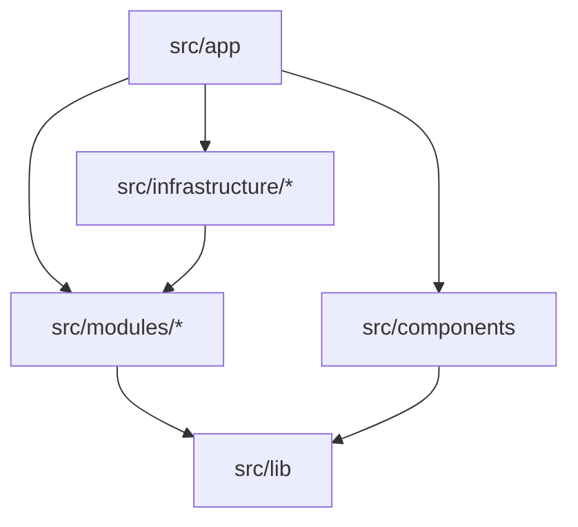

# Forma — Repository Structure (Usulan)

**Tanggal:** 9 Oktober 2026
**Status:** Usulan; belum ada folder `src/` yang dibuat. Menunggu D-01, D-02, D-15 di [TECHNICAL_DECISIONS](TECHNICAL_DECISIONS.md).
**Prinsip:** mudah dipahami pemula · satu tempat per tanggung jawab · logika murni terpisah dari UI · tumbuh tanpa memindahkan folder.

Struktur ini menyelesaikan ambiguitas blueprint §11 vs §12 (konflik C-08) dengan **satu aturan**: *logika produk tinggal di `src/modules/<nama>`; `src/app` dan `src/components` hanya tampilan.*

---

## 1. Struktur target

```text
Forma/
├── 00_PRODUCT_BLUEPRINT.md … 05_FIRST_RUN_PROMPT.md   # dokumen sumber (tetap di root dulu, lihat D-07)
├── README.md
├── AGENTS.md                      # dari create-next-app + aturan Forma (R0)
├── package.json  package-lock.json  tsconfig.json  eslint.config.*  next.config.*
├── vitest.config.ts  playwright.config.ts
├── .env.example                   # selalu tanpa nilai rahasia nyata
├── .gitignore
│
├── docs/
│   ├── audits/                    # INITIAL_AUDIT.md, audit lanjutan
│   ├── architecture/              # roadmap, decisions, structure, SYSTEM_ARCHITECTURE.md (R2+)
│   ├── decisions/                 # ADR-XXXX-*.md
│   ├── product/                   # (opsional, D-07) blueprint kanonis
│   ├── prompts/                   # (opsional, D-07) katalog + chain
│   ├── security/                  # SECURITY_AND_PRIVACY.md (R2+)
│   └── testing/                   # TEST_STRATEGY.md (R2+)
│
├── src/
│   ├── app/                       # ROUTE saja: layout, page, route handler. Tanpa logika bisnis
│   │   ├── (shell)/               # layout aplikasi
│   │   ├── projects/              # daftar, buat, detail proyek
│   │   └── studio/                # Prompt Studio per proyek/template
│   │
│   ├── components/
│   │   ├── ui/                    # primitif: Button, Input, Textarea, Dialog, Tabs
│   │   └── shared/                # lintas modul: PageHeader, EmptyState, CopyButton
│   │
│   ├── modules/                   # ← LOGIKA PRODUK, satu folder per domain
│   │   ├── projects/              # Project, ProjectAnswer, ProjectRepository (port)
│   │   ├── prompt-compiler/       # ★ inti: murni TS, nol import react/next
│   │   │   ├── layers/            # global-contract, envelope, adapters (web/mobile/backend)
│   │   │   ├── engine/            # TemplateRenderer interface + implementasi (LiquidJS/custom)
│   │   │   ├── filters/           # or_unknown, format_list_or_unknown, format_list_or_none, or_default
│   │   │   ├── resolve-context.ts # answers + derived → ProjectContext
│   │   │   ├── validate.ts        # required, unresolved token, secret, conflict
│   │   │   ├── compile.ts         # fungsi publik compile()
│   │   │   └── index.ts           # satu-satunya pintu masuk publik
│   │   ├── templates/             # registry + seed P-00… (data), versi read-only, schema metadata
│   │   │   └── seeds/             # P-00-IDEA/v1, … (Markdown + metadata terstruktur)
│   │   ├── runs/                  # PromptGenerationRun, ContextSnapshot, RunRepository (port), hashing
│   │   ├── prompt-chain/          # (R4) dependency graph, stale (dihitung)
│   │   ├── agent-results/         # (R4) capture, review, approve/reject
│   │   ├── exports/               # (R5) single .md, prompt pack
│   │   ├── artifacts/             # (R6, dipangkas)
│   │   └── ai-assistance/         # (R7) AiProvider port + adapter; opsional
│   │
│   ├── infrastructure/            # adapter ke dunia luar (mengimplementasi port)
│   │   ├── storage-browser/       # R2: localStorage/IndexedDB repositories
│   │   └── storage-server/        # R3: DB repositories (diputuskan D-03)
│   │
│   └── lib/                       # utilitas kecil yang benar-benar generik (id, tanggal, hash)
│
├── tests/
│   ├── fixtures/                  # 10 fixture katalog §11 + golden output
│   ├── unit/                      # (atau ko-lokasi *.test.ts di dalam modul)
│   ├── integration/
│   └── e2e/                       # Playwright
│
└── public/
```

> **Catatan lokasi test:** unit test sebaiknya **ko-lokasi** (`compile.test.ts` di sebelah `compile.ts`) agar pemula mudah menemukannya; `tests/` dipakai untuk fixture bersama, integrasi lintas modul, dan E2E. Dapat disesuaikan saat R0.

---

## 2. Tanggung jawab tiap bagian

| Bagian | Bertanggung jawab atas | **Tidak** boleh |
|---|---|---|
| `src/app` | Routing, layout, memuat data, merangkai komponen | Berisi aturan bisnis, merakit prompt, memanipulasi string template |
| `src/components/ui` | Primitif visual dan aksesibilitas (focus, label) | Mengimpor dari `modules` |
| `src/components/shared` | Komponen lintas modul yang tidak punya aturan domain | Mengimpor dari `infrastructure` |
| `modules/prompt-compiler` | Menggabungkan template + konteks → teks; validasi; deteksi konflik; redaksi | Mengimpor `react`, `next`, `window`, `localStorage`, `fs`, jaringan; memanggil AI |
| `modules/templates` | Menyimpan dan memverifikasi template + versi + metadata (schema Zod) | Mengubah versi published in-place |
| `modules/projects` | Entitas proyek/jawaban, schema, port repository, aturan certainty | Mengetahui cara penyimpanan |
| `modules/runs` | Membuat run immutable, snapshot, hash; port repository run | Mengubah run yang sudah dibuat |
| `modules/prompt-chain` / `agent-results` | Dependency, approval, stale | Menyetujui otomatis hasil agent |
| `modules/exports` | Menyusun `.md`/pack dari run, memeriksa secret sebelum keluar | Mengekspor data di luar snapshot |
| `modules/ai-assistance` | Provider interface + adapter (opsional) | Menjadi dependency compile/copy/export |
| `infrastructure/*` | Implementasi port: baca/tulis penyimpanan | Berisi aturan domain |
| `lib` | Fungsi generik kecil | Menjadi tempat sampah (`utils` raksasa dilarang blueprint §12) |
| `docs/*` | Dokumen hidup; satu sumber kebenaran per topik | Menggandakan konten lain (cukup tautan) |
| `tests/fixtures` | Data uji bersama + golden prompt | Berisi secret nyata |

---

## 3. Aturan dependensi (ditegakkan ESLint di R0)



1. `modules/*` **tidak** mengimpor dari `app`, `components`, atau `infrastructure`.
2. `modules/prompt-compiler` dan `modules/templates` hanya boleh mengimpor `zod`, `lib`, dan engine template; **tidak boleh** `react`/`next`.
3. Modul lain diakses lewat `index.ts` publiknya (bukan impor file dalam). Dicek dengan `no-restricted-imports`.
4. Kode yang menyentuh browser API hanya di `infrastructure/storage-browser` dan komponen klien.
5. Tidak ada siklus antar modul; `prompt-chain` boleh memakai `runs`/`agent-results`, tidak sebaliknya.

## 4. Aturan penamaan & konvensi

- Folder dan file: `kebab-case`; tipe/komponen: `PascalCase`; fungsi: `camelCase`.
- Template: `P-<nn>[W|M]-<SLUG>` mengikuti katalog (mis. `P-00-IDEA`); versi `v1`, `v2` immutable setelah dipakai.
- Variable path stabil: `project.name`, `product.problem`, … (katalog §3). Path derived memakai awalan `derived.` (menyelesaikan C-05).
- ADR: `docs/decisions/ADR-0001-judul-singkat.md`.
- Tidak ada `any` / non-null assertion tanpa komentar alasan (master prompt §C).
- `.env.example` hanya berisi nama variabel; MVP-Core tidak membutuhkan variabel apa pun.

## 5. Apa yang sengaja *tidak* dibuat

- Tidak ada folder `services/`, `utils/` raksasa, `domain/` global, `server/` global. `modules/*` dan `infrastructure/*` cukup.
- Tidak ada `prisma/` atau `db/` sampai D-03 diputuskan.
- Tidak ada monorepo (`apps/`, `packages/`). Compiler dapat diekstrak nanti karena sudah murni dan berbatas jelas.
- Tidak ada folder per-halaman berisi logika; halaman = rangkaian komponen.

## 6. Pemindahan dokumen sumber (opsional, D-07)

Rencana hanya bila disetujui, dilakukan sebagai satu perubahan terpisah dengan pembaruan tautan:

| Dari | Ke |
|---|---|
| `00_PRODUCT_BLUEPRINT.md` | `docs/product/00_PRODUCT_BLUEPRINT.md` |
| `01_AI_AGENT_MASTER_PROMPT.md` | `docs/prompts/01_AI_AGENT_MASTER_PROMPT.md` (atau tetap di root sebagai instruksi agent) |
| `02_RESEARCH_AND_STANDARDS.md` | `docs/product/02_RESEARCH_AND_STANDARDS.md` |
| `03_PROMPT_TEMPLATE_CATALOG.md` | `docs/prompts/PROMPT_TEMPLATE_CATALOG.md` |
| `04_EXAMPLE_PROMPT_CHAIN.md` | `docs/prompts/EXAMPLE_PROMPT_CHAIN.md` |
| `05_FIRST_RUN_PROMPT.md` | tetap di root atau `docs/prompts/` |

Sebelum dipindah: cari semua rujukan nama file di dokumen (grep) dan perbarui, termasuk README. Sampai persetujuan, **jangan memindahkan**.
