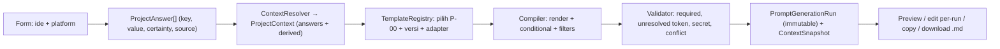

# Forma — Technical Decisions

**Tanggal:** 9 Oktober 2026
**Status dokumen:** Draft untuk persetujuan. Belum ada ADR resmi; setiap keputusan yang disetujui akan dipromosikan menjadi `docs/decisions/ADR-XXXX-*.md` pada fase R0 (sesuai master prompt).
**Terkait:** [INITIAL_AUDIT](../audits/INITIAL_AUDIT.md) · [IMPLEMENTATION_ROADMAP](IMPLEMENTATION_ROADMAP.md) · [REPOSITORY_STRUCTURE](REPOSITORY_STRUCTURE.md)

Label: **APPROVED** (sudah tertulis di dokumen sumber), **RECOMMENDED** (usulan, menunggu persetujuan), **ASSUMPTION** (dipakai agar kerja tidak terblokir; belum disetujui), **OPEN**.

---

## 1. Keputusan yang sudah disetujui (dari dokumen sumber)

| ID | Keputusan | Sumber |
|---|---|---|
| A-01 | Responsive web app tunggal (bukan web + mobile terpisah) | Blueprint §4.1 |
| A-02 | Satu core workflow + platform adapter | Blueprint §4.2, README |
| A-03 | Prompt Compiler deterministik; berjalan tanpa API AI key | Blueprint §4.4, §5A.3; master §D |
| A-04 | Keluaran utama = prompt siap pakai; `.md` sebagai format portabel | Blueprint §4.5 |
| A-05 | Modular monolith, bukan microservices | Blueprint §4.6 |
| A-06 | Template engine terstruktur dengan allowlist; tanpa `eval`/JS arbitrer/akses fs-network | Blueprint §5A.5; katalog §4 |
| A-07 | Prompt run immutable: versi template + snapshot konteks | Blueprint §13; katalog §3 |
| A-08 | Hanya `AgentResult` berstatus `approved` menjadi konteks resmi | Katalog §1 |
| A-09 | Unknown tidak boleh dikarang; dirender sebagai ketidakpastian eksplisit | Katalog §4 |
| A-10 | Progress/readiness tidak berupa skor 0–100 yang tidak dapat dijelaskan | Blueprint §17 |
| A-11 | Bahasa produk awal Bahasa Indonesia, struktur siap dilokalkan | Blueprint header |

Hal berikut di blueprint **bukan** keputusan final (disebut "baseline yang perlu divalidasi"): Next.js, Tailwind/shadcn, PostgreSQL, Zod, Vitest, Playwright.

---

## 2. Rekomendasi yang menunggu persetujuan

Ringkasan, lalu detail trade-off di §4.

| ID | Rekomendasi | Perlu persetujuan? | Blocker untuk |
|---|---|---|---|
| D-01 | Pisah **MVP-Core** vs MVP-Full; urutkan compiler → UI minimal → persistence server → chain → export | **Ya** (menyimpang dari blueprint §18, §16) | R1 |
| D-02 | MVP-Core: penyimpanan **di browser** (localStorage dulu) di balik `ProjectRepository` port; tanpa database server, tanpa auth | **Ya** | R2 |
| D-03 | Database server + deployment diputuskan **sebelum R3**, bukan sekarang | Tidak sekarang | R3 |
| D-04 | Template engine: **LiquidJS** hanya bila spike membuktikan allowlist tag; fallback renderer minimal sendiri | Ya (menambah dependency) | R1 |
| D-05 | Tambah nilai `certainty = preference` | **Ya** (mengubah katalog) | R1 |
| D-06 | Bahasa prompt MVP: **Indonesia** untuk seluruh template bawaan, istilah teknis tetap Inggris | **Ya** | R1 |
| D-07 | Dokumen sumber tetap di root; relokasi ke `docs/product`, `docs/prompts` sebagai tugas terpisah | Opsional | — |
| D-08 | `git init`, `.gitignore`, `AGENTS.md` dari `create-next-app`, package manager **npm** | Ya (menyentuh repo) | R0 |
| D-09 | `stale` **dihitung** (hash konteks/versi upstream), bukan status tertulis di run immutable | Ya | R4 |
| D-10 | MVP-Core tanpa auth; skema tetap membawa `ownerId` (nilai tetap lokal) | Ya | R2 |
| D-11 | Provider AI & BYOK ditunda; hanya `AiProvider` port kosong, tidak dibuat di R0–R5 | Tidak sekarang | R7 |
| D-12 | Approval hasil agent per hasil (setelah diedit), bukan per bagian | Ya | R4 |
| D-13 | Secret terdeteksi → `blocked` + tawaran redaksi eksplisit | Ya | R1 |
| D-14 | Template MVP-Core: P-00 penuh; P-01, P-02 untuk chain; P-04W/P-04M untuk adapter. Sisanya setelahnya | Ya | R1 |
| D-15 | Konvensi stack: Zod untuk validasi, Vitest untuk unit/integration, Playwright untuk E2E, ESLint dari scaffold | Ya (ditinjau saat scaffold) | R0 |

---

## 3. Arsitektur MVP yang direkomendasikan

### 3.1 Prinsip

1. **Compiler adalah pustaka TypeScript murni** (tanpa React, tanpa Next, tanpa I/O). Diuji lewat Vitest tanpa browser dan database. Ini memenuhi "domain logic dapat diuji tanpa browser/database produksi" (NFR Testability).
2. **UI tipis.** Next.js App Router hanya merangkai: halaman → Server/Client Component → memanggil modul.
3. **Persistence di balik port** (`ProjectRepository`, `RunRepository`). Implementasi pertama: browser. Implementasi kedua (R3): server DB. Compiler dan domain tidak tahu bedanya.
4. **Data jawaban terstruktur** dengan key stabil + certainty + source, bukan string.
5. **Immutable runs** diperlakukan sebagai append-only.

### 3.2 Alur data (MVP-Core)

Lapisan prompt (blueprint §5A.2) dikomposisi di dalam compiler: global contract → project context envelope → stage template → platform adapter → upstream pack (kosong di Slice pertama) → run overrides → output contract.

### 3.3 Model domain minimum MVP-Core (6 dari 25+ entitas)

| Entitas | Alasan |
|---|---|
| `Project` | Wadah ide, platform, track |
| `ProjectAnswer` | Konteks terstruktur (key, value, valueType, certainty, source, updatedAt) |
| `PromptTemplate` + `PromptTemplateVersion` | Registri; versi bawaan read-only, dimuat dari kode/file |
| `ProjectContextSnapshot` | Bukti konteks yang dipakai |
| `PromptGenerationRun` | Hasil immutable; `userEditedPrompt` terpisah dari `compiledPrompt` |

Ditunda sampai fase masing-masing: `AgentResult`, `PromptChainLink` (R4); `Artifact`/`ArtifactVersion`, `Requirement`, `TraceLink`, `BacklogItem`, `Risk`, `GateEvaluation` (R6, itupun dipangkas); `AIInteraction` (R7); `ExportRecord` (R5); `User`/`Workspace` (saat multi-user).

### 3.4 Stack yang direkomendasikan (menunggu persetujuan D-15)

| Lapisan | Pilihan | Alasan | Verifikasi |
|---|---|---|---|
| Framework | Next.js App Router + TypeScript, via `npx create-next-app@latest --yes` (bukan versi hardcode) | Disetujui sebagai baseline; scaffold resmi menyertakan Tailwind, ESLint, `AGENTS.md`; Node 22.23 lokal memenuhi syarat ≥20.9 | FACT (docs + npm) |
| Styling | Tailwind CSS dari scaffold. **shadcn/ui tidak diadopsi di awal**; komponen primitif dibuat seperlunya (button, input, textarea, dialog, tabs). Adopsi shadcn jika ≥5 primitif kompleks dibutuhkan | Mengurangi dependency untuk pemula; satu design token di `globals.css` | RECOMMENDED |
| Validasi | Zod | Schema bersama untuk jawaban, template metadata, input form | npm: `4.6.5` ada (FACT); cocok-tidaknya dengan stack: dicek saat scaffold |
| Template engine | LiquidJS **bersyarat** (D-04) | Sintaks katalog sudah Liquid-style; ada `strictFilters`, `strictVariables`, `ownPropertyOnly`, `outputEscape`; filter kustom dapat didaftarkan | Opsi: FACT; allowlist tag: **belum terverifikasi** |
| Unit/integration test | Vitest | Disebut blueprint; Node lokal memenuhi `^22.12` | npm: FACT |
| E2E | Playwright (mulai R2) | Disebut blueprint; emulasi mobile | npm: FACT |
| Persistence R2 | localStorage via port | Nol dependency, nol migrasi | RECOMMENDED |
| Persistence R3 | Ditentukan D-03 | Lihat §4.3 | OPEN |
| Auth | Tidak ada (D-10) | MVP-Core single-user lokal | RECOMMENDED |
| AI provider | Tidak ada (D-11) | Tidak dibutuhkan compiler | RECOMMENDED |
| ZIP | Ditunda ke R5; kandidat `fflate` | Perlu dibandingkan dengan `jszip` saat itu | OPEN |

---

## 4. Trade-off per keputusan

### 4.1 D-01 — Cakupan MVP & urutan fase

| Opsi | Kelebihan | Kekurangan |
|---|---|---|
| A. Ikuti blueprint §18 apa adanya | Tidak ada keputusan baru | Dashboard/CRUD sebelum nilai inti; 20 kriteria MVP |
| **B. MVP-Core dulu (direkomendasikan)** | Nilai inti terbukti di slice 2; risiko scope creep turun; tiap slice bisa di-demo | Menyimpang dari urutan tertulis; butir 4,5,6,14 menunggu |

Konsekuensi B: UI shell di R2 hanya berisi yang dipakai flow (daftar proyek sederhana, form, studio). Tidak ada dashboard dekoratif.

### 4.2 D-02 — Persistence MVP-Core

| Opsi | Kelebihan | Kekurangan |
|---|---|---|
| **A. Browser (localStorage → IndexedDB bila perlu)** | Tanpa dependency/migrasi; jalan di hosting statis; tidak ada risiko cross-user | Data hanya di satu browser/perangkat; kuota terbatas; bukan "lintas perangkat" yang disebut blueprint |
| B. SQLite file via Drizzle/better-sqlite3 | Server-side, relasional, cocok lokal | Tidak cocok di serverless filesystem ephemeral (deployment belum diputuskan); menambah native dependency (`better-sqlite3` 13.0.3, Node ≥22) |
| C. PostgreSQL + ORM | Baseline blueprint; lintas perangkat | Butuh hosting + biaya + migrasi + auth di depan; menunda nilai inti; Prisma latest saat ini RC (`8.0.0-rc.22`) |

Rekomendasi A untuk R2, dengan **port** sehingga R3 bisa mengganti ke B/C. Mitigasi kehilangan data: tombol Export/Import JSON di R2. Konsekuensi: pernyataan blueprint "PostgreSQL baseline bila lintas perangkat" **tidak dipenuhi di MVP-Core**; ditulis jujur di UI ("tersimpan di browser ini").

### 4.3 D-03 — Database server & deployment (ditunda)

Pertanyaan terbuka dikumpulkan di §6. Rekomendasi sementara: jika target akhir = hosting serverless dan multi-user → PostgreSQL terkelola + auth library yang dipelihara; jika target = pemakaian pribadi → tetap browser/SQLite lokal + export. Jangan memilih Prisma 8 RC untuk data persisten; Drizzle masih 0.x. Keduanya perlu pemeriksaan docs saat R3.

### 4.4 D-04 — Template engine

| Opsi | Kelebihan | Kekurangan |
|---|---|---|
| **LiquidJS (bersyarat)** | Sintaks katalog sudah cocok; aktif (10.30.0, Okt 2026); opsi strict tersedia | Tag tidak otomatis dibatasi allowlist (**belum terbukti**); `render`/`include` perlu dimatikan; kompleks untuk kebutuhan kecil |
| Handlebars 4.7.10 | Aktif; logika minimal | Sintaks berbeda → semua template ditulis ulang; riwayat isu prototype/helper perlu dicek |
| Renderer buatan sendiri | Kontrol penuh; permukaan serang minimal; tak ada dependency | Harus dibangun & diuji sendiri (parser kecil); risiko bug parsing |
| Mustache / Nunjucks | — | Mustache tanpa conditional logika kaya; Nunjucks terakhir dirilis 2023 |

Keputusan ditunda ke **spike di R1** dengan kriteria lulus: (1) tag selain `if/else/for/assign?` dapat ditolak saat parse; (2) tidak ada akses `fs`; (3) 10 fixture katalog dapat dirender; (4) variable tak dideklarasikan ditolak. Jika gagal salah satu → renderer sendiri. Kode compiler membungkus engine di balik `TemplateRenderer` interface sehingga bisa diganti.

### 4.5 D-05 — `certainty = preference`

Diperlukan agar "Flutter = preferensi, bukan keputusan" dapat dirender benar (contoh `04`). Alternatif memetakan ke `assumption` kehilangan nuansa dan menyalahi contoh. Dampak: enum + teks compiler + fixture bertambah satu cabang.

### 4.6 D-06 — Bahasa prompt

Rekomendasi: seluruh template bawaan Bahasa Indonesia, nama bagian output (`IDEA_SUMMARY`, dst.) tetap Inggris-snake agar stabil untuk parsing hasil agent. Template memiliki field `locale` (default `id`) agar bisa dilokalkan nanti. Alternatif (prompt Inggris karena agen coding umumnya kuat dalam Inggris) belum diuji; **OPEN**: apakah pengguna ingin opsi Inggris.

### 4.7 D-09 — Stale dihitung

Run immutable tidak boleh diubah, sementara katalog menyebut status `stale`. Solusi: run menyimpan `contextHash` dan daftar `{artifactId, version}` upstream; status tampilan `stale` = hasil perbandingan dengan konteks approved terkini. Tidak ada mutasi pada run; riwayat tetap utuh.

### 4.8 D-10 — Tanpa auth di MVP-Core

Alasan: tidak ada data di server → tidak ada permukaan IDOR; menambahkan auth sebelum ada server hanya menambah kompleksitas. Syarat: **auth + otorisasi server wajib sebelum R3 dipublikasikan**. Skema `ownerId` disiapkan agar migrasi tidak merusak data. Kriteria MVP #15 (IDOR) ditandai "ditunda ke R3" dengan alasan tertulis.

### 4.9 D-13 — Secret

Pola awal (disepakati saat R1, bukan di sini): kunci cloud/provider umum, `-----BEGIN ... PRIVATE KEY-----`, JWT-like, `password=`/`token=` literal. Deteksi heuristik; **tidak** mengklaim bebas secret. Perilaku: `blocked` sampai pengguna menghapus atau menyetujui redaksi.

---

## 5. Asumsi yang dipakai (belum disetujui, tidak memblokir)

| ID | Asumsi | Jika salah |
|---|---|---|
| AS-01 | Pengguna awal = satu orang (pemilik proyek) di satu browser | Percepat R3 (server + auth) |
| AS-02 | Runtime lokal Node 22.23; tidak ada target Node lain | Cek `engines` saat scaffold |
| AS-03 | Browser target: Chrome/Edge/Firefox/Safari versi stabil terbaru; viewport 360 px & 1280 px | Ubah matriks Playwright |
| AS-04 | Satu locale (`id`) di MVP-Core | Pindahkan ke i18n lebih awal |
| AS-05 | npm sebagai package manager (npm 10.9.8 terpasang; pnpm/yarn tidak diperiksa) | Ganti perintah di dokumen |
| AS-06 | Ukuran konteks kecil (puluhan KB); tidak ada batas keras dahulu | Tambahkan limit konfigurasi |
| AS-07 | `create-next-app` default "Cache Components" tidak merugikan; diverifikasi saat scaffold | Matikan/ubah opsi scaffold |
| AS-08 | Tidak ada kebutuhan kepatuhan khusus (PII sensitif, pembayaran) | Naik ke track Advanced |

---

## 6. Pertanyaan terbuka

1. **Deployment:** hosting apa, berbayar atau gratis, publik atau hanya pribadi? (menentukan D-03)
2. **Multi-user:** kapan, jika pernah? (menentukan kapan auth)
3. **Bahasa prompt:** apakah perlu opsi Inggris pada MVP-Full? (D-06)
4. **Template custom pengguna:** wajib di MVP-Full atau cukup clone/duplikat sederhana? (risiko R-01)
5. **Format golden prompt untuk P-00:** katalog (tanpa envelope) atau contoh `04` (dengan envelope)? Rekomendasi: katalog + envelope + contract (C-04); butuh satu kali konfirmasi hasil render.
6. **Ukuran dan sumber teks pertanyaan** per template (G-07): ditulis oleh auditor/agent dan direview pemilik produk, atau pemilik menyediakan?
7. **Nama merek/domain Forma** belum diverifikasi (blueprint header). Tidak memblokir.
8. **Instruksi agent global** di `C:\Users\ACER\.gemini\config` tidak terbaca; jika ada aturan di sana yang relevan, mohon diinformasikan.

---

## 7. Jalur promosi ke ADR

Setelah persetujuan, R0 menulis ADR berikut (satu file masing-masing, format konteks/opsi/keputusan/konsekuensi): ADR-0001 scope MVP-Core & urutan fase (D-01) · ADR-0002 persistence MVP-Core (D-02, D-10) · ADR-0003 template engine (D-04, setelah spike) · ADR-0004 vocabulary certainty & derived namespace (D-05, C-05) · ADR-0005 bahasa prompt (D-06) · ADR-0006 stale & immutability (D-09) · ADR-0007 secret policy (D-13).
